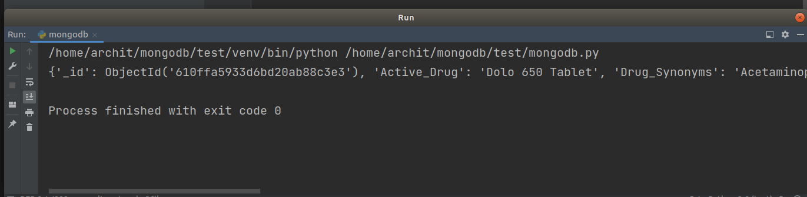
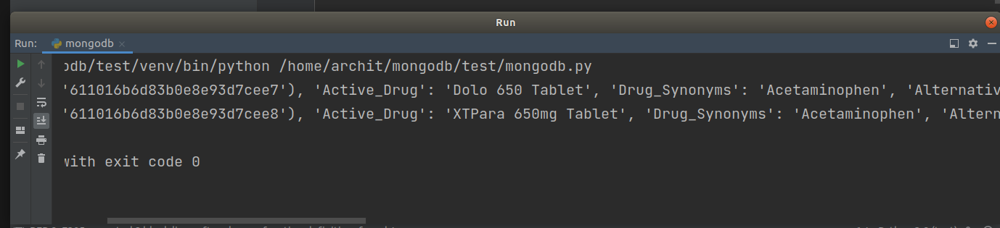

# 1mg-data-mongoDB
The following is the pyhton script which collects vitals anout a given medicine / drug from the 1mg website and stores it into a database.
**Stack** - *Selenium (Python) , MongoDB (Database)*
#### Overview
The following is the overview of the repo 
* **main** - This is the main script which import and runs resources (functions) from othe rhelper script in order to perform function. *Run this script only in order to perform the task.*
* **scrapper** - This the helper script which contains function that returns a dictionary of all the data correspomding to each heading / info. It is called and run for multiple times for multiple urls in loop form **main.py** .
* **mongodb** - This is the helper script which contains function that inserts bulk data into tht mongoDB database at once. 
* **chromedriver** - This is the drivers to enable slenium bot access and use your browser in automated fashion. May vary for user to user check from [here](https://chromedriver.chromium.org/downloads).
* **requirements.txt** - This is file contains all the dependecies of the project.
* **urls.csv** - This contains the links of all the products whose details are to be fetched.

#### Usage Instruction 
* Clone the given github repository using 
  ```git@github.com:architsharmaa/1mg-data-mongoDB.git``` (for SSH keys)
  ```https://github.com/architsharmaa/1mg-data-mongoDB.git``` (for https)
* Install the required dependencies using 
``` pip install requirements.txt```
* Set the ```Chromedriver``` based on your browser version [chromedriver](https://github.com/architsharmaa/1mg-data-mongoDB.git)
* Run the given **scrapper** by running code in main or enter following command
```python main.py```

#### Outputs
* Data produced by scrapper :

* Final data stored in the MongoDB database:



